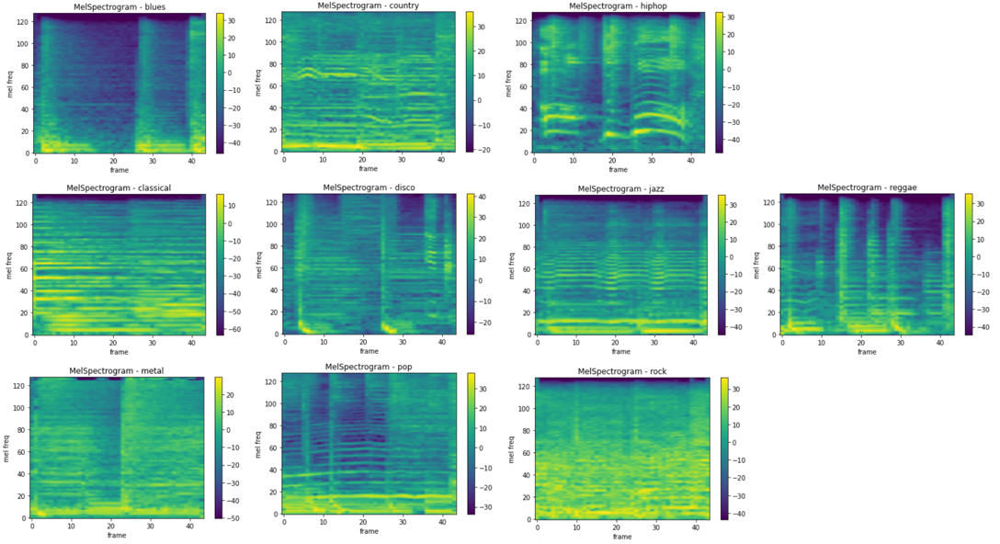

## 基于内容的音乐推荐系统设计与开发

> 本作品是我大学本科的毕业设计，是我初步学习神经网络的一个完整作品。在学习以及完成作品中也参考了很多资料以及其他各类项目。本项目仅供大家学习，欢迎大家留言与我交流。
>
> This work is my undergraduate graduation project, and it is a complete work of my preliminary study of neural network. In the study and the completion of the work, I also refer to a lot of materials and other various projects. This project is only for everyone to learn, welcome to leave a message to communicate with me.
>
> Bilibili 个人主页：https://space.bilibili.com/383843542

### 设计结构

### 数据处理

需要对标签数据清洗以及将音频信号转化为频谱信号。本次数据集采用公开音频数据集GTZAN，其中包含了10种不同风格的音乐，每一种音乐都包含100个音频文件，每个音频文件都是30秒。同时需要将音频信号转化为频谱信号，本论文将转化为梅尔频谱，直接使用pytorch的torchaudio中的函数即可快速转化。

- 将音频信号转化为梅尔频谱

  梅尔频谱图是将频率转换为梅尔刻度的频谱图。使用梅尔频谱可以起到压缩数据、数据拥有更多的表征能力，同时有论文表明与传统的傅里叶变化相比，转化为梅尔频谱的样本可以提高训练的准确率。

### 神经网络

本项目选用卷积神经网络AlexNet。一个是对于初学者有较好较多的学习点，另一个是网络比较简单，对于这个小样本集有比较良好的效果。

- AlexNet 的网络结构

  

- 单样本的训练流程

### 音乐推荐系统

使用Django实现推荐系统的功能，提供前后端交互页面。

> 项目体验地址：https:// fishei.cn/project

​	

### 如何使用推荐功能

- 点击爱心，将会对本首歌进行推荐

- 在推荐列表中将展示相似度最高的5首歌曲（具体原理我将在Bilibili描述）

### 如何使用本项目

- 下载数据集

> OSS流量要钱，那我就放在阿里云盘了：「GTZAN」https://www.aliyundrive.com/s/dQG715hETzr

- 训练模型

> 训练模型的代码为Jupyter Notebook格式，如果大家电脑有GPU那就在自己电脑上训练就可以了，如果没有，推荐大家使用Kaggle。
>
> https://www.kaggle.com/  每周大概有40多小时白嫖的GPU时长，无需翻墙，自认为比colab好用一些。

根目录下 **文件 [recommend.ipynb](./recommend.ipynb) 即为训练代码，训练后生成模型参数文件 best_model_okk.pth**

- 构建Django前后端

根目录下 **文件  [recommend](./recommend) 即为 Django 项目，记得将GTZAN数据集文件放在目录recommend/music/static/GTZAN下**

接下来即可使用pycharm启动项目

- 项目部署

> 如何对项目部署，这块内容我之后会在Bilibili发布

![image-20220528092401838]picture/项目部署.png)

### 其他

前端页面参考项目：https://github.com/Ezenlee/WebMusicPlayer

音频处理学习：https://www.youtube.com/watch?v=gp2wZqDoJ1Y&list=PL-wATfeyAMNoirN4idjev6aRu8ISZYVWm

> 2022年即将结束了我在本科阶段的学习生活，这一路还是有蛮多值得留恋的东西，接下来好好规划，继续加油！

